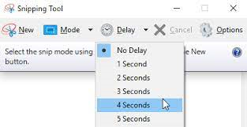

# Testing_with_Pyautogui
Demo project of using black box testing with Python and Pyautogui

## Description of the project
The project shows a simple application in Visual C# and how to test it with Python and Pyautogui. Pyautogui allows the user to use mouse and keyboard functions to automatically advance through a  program.

## Installation
### Pyautogui
After installing Python 3, add Pyautogui with the command pip install pyautogui.
### Visual Studio
The program to be tested is written in Visual C# and Visual Studio is the easiest language to edit and test it. On the [download page](https://visualstudio.microsoft.com/downloads/), select the Community Edition (free) and make sure that you install Visual C#. 

## Test application
The application is Stadium Seating, a slight modification from an exercise in the Visual C# textbook xxxxxx. The controls have been renamed with Hungarian notation (txtClassA for the number of Class A tickets for instance). For testing purposed, the text boxes for the outcome of the calculations, which are normally set to ReadOnly and TabStop false, have been set to TabStop True so they can be tested. The Tab sequence has been set to classA, classB, ClassC, Calculate, revenueA, revenueB, revenueC, totalRevenu, Clear, and Exit. Upon Clear, the focus shifts automatically back to classA. 

## Test script 1
The first script,test_runner.py, in the folder "testing", relies on tabbing through the controls with the Tab key. Upon opening the form, focus is on the first text box. The script adds a number and tabs to the next box. Tabbing with the pyautogui.write('\t') and clicking on buttons with pyautogui.press('enter') walks the script through the form.

## Test script 2
The second scrit, nsu_webpage.py, is in the folder "testing02". In this script, we work with optical recognition. The first method to use is .locateOnScreen(picture). This returns the location of the screencapture with four integers: top, left, width, and height. The next method, .center(tuple), uses this tuple to locate the center of the picture with two integers for left and right. This location can then be clicked, selected, or otherwise used. 
The three steps separately are (assuming a picture square.png):
* square = pyautogui.locateOnScreen('square.png')
* square_center = pyautogui.center(square)
* pyautogui.click(square_center)
These three steps can also be chained as follows:
* pyautogui.click(pyautogui.center(pyautogui.locateOnScreen('square.png')))

### Recommendations for screen captures.
* On Windows, consider the new Snip and Sketch application. The nicest feature is the delayed capture, if you need to capture a popup window. 



* Screen captures may work better if you use larger rectangles. For instance, capture not only a button but also the surrounding area. As long as you keep the center of the image over the clickable area, clicking will work.
* Use .png files rather than .jpg file. They appear to do better.
* Image recognition may take some time. Consider using your own custom variable delay with something like 
```
while pyautogui.locateOnScreen('square.png') is None:
        pyautogui.PAUSE = 0.5
```